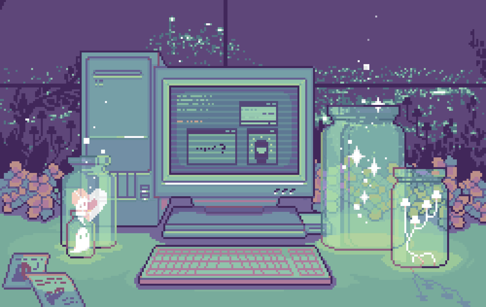

# 🏝️ >Connact\_

I'm a little interested in C# programming, nothing special, a lot of crap code, but I'm okay with it. 
I broadcast live on various games on my [VK Live channel](https://live.vkvideo.ru/connact)
I play World of Warcraft, love medieval fantasy, and build various medieval-style structures in Minecraft.

## 🪴 Technologies I use

> **Note:**
> I'm not the author of this pixel art, but I really like it.

### 📌 My VScode configuration

📂 <a href="https://github.com/connact-community/VScode-settings" target="_blank" rel="noopener noreferrer" alt="My settings for VScode">My settings for VScode</a> (Settings, snippets, keybindings) 
