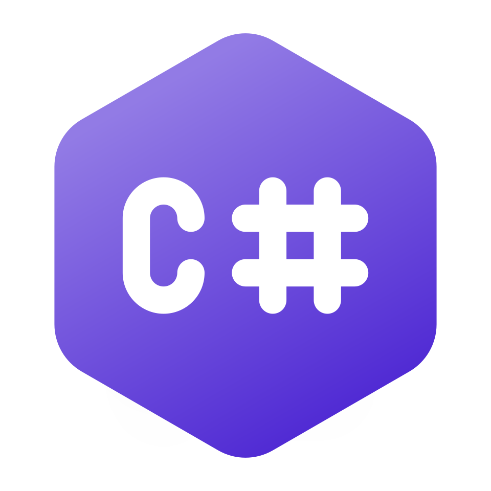

# 🏝️ >Connact\_

I create console and UI programs in C# and websites for myself.

## 🪴 Technologies I use

  
  
  
  
  

### 📌 My VScode configuration

📂 <a href="https://github.com/connact-community/VScode-settings/tree/main" target="_blank" rel="noopener noreferrer" alt="My settings for VScode">My settings for VScode</a> (Settings, snippets, keybindings) 

